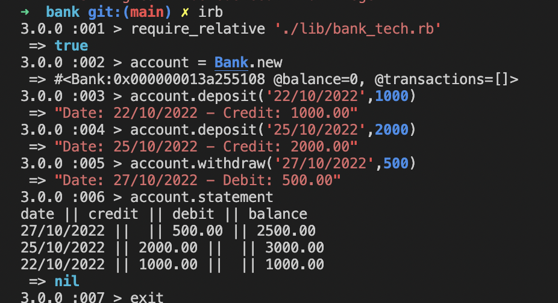

# Bank Tech Test

## Specifications 

The goal of this tech test is to create a program that replicates a bank's account activities such as deposit money, withdraw and check statement using TDD approach.

To achieve it, I used Ruby, RSpec for testing, Rubocop for analyse the code quality and SimpleCov to check the tests coverage.

## Installation 

* Clone or download this repository
* cd to Bank
* bundle install
* rspec (to run the tests and coverage)

## Example of running app in irb

There are three methods:

* deposit(date, amount) - To add money to account accepts two parameters date in format (DD-MM-YYYY) and amount in integer or float number

* withdraw(date, amount) - To take money of account

* statement - To print all transactions

<h1>Thank you</h1>